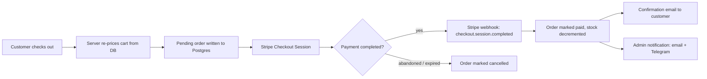

# HotVitality

An e-commerce storefront for dietary supplements, built with Next.js and a
real backend: Supabase for data and auth, Stripe for
payments, Resend for email.

It's a working store, not a demo — checkout goes through actual Stripe
Checkout, orders land in Postgres, and customers get a real confirmation
email once payment clears.

**Live:** [hotvitality.vercel.app](https://hotvitality.vercel.app)

## Home/Storefront

## Cart

## Checkout — Address Autocomplete (Google Places API)

## Admin Dashboard

## Stack

- **Next.js 14** (App Router) + TypeScript
- **Supabase** — Postgres database, authentication, and file storage for
  product images
- **Stripe Checkout** — payment processing
- **Resend** — transactional email (order confirmations, plus Supabase
  Auth's signup/password-reset emails via SMTP)
- **Google Places API** — address autocomplete on checkout (fails open to a
  plain text input if the key isn't set)
- **Tailwind CSS v4** + Shadcn UI (built on Base UI primitives)

## How it's put together

The cart lives entirely in the browser (`localStorage`) — no account needed
to add items or check out as a guest. When a customer checks out, the server
re-prices everything from the database (the cart in the browser is never
trusted), writes a pending order, and hands off to Stripe. Stripe's webhook
is the only thing that ever marks an order as paid, and that same webhook
kicks off the confirmation email — the success page you land on after paying
is just a receipt, not the source of truth.

The admin dashboard (`/admin`) is gated by role, not just a login check —
only accounts with `role = 'admin'` in the `profiles` table get past the
layout guard. From there you can manage products (including drag-and-drop
image uploads straight to Supabase Storage), see orders and revenue, and
look at registered users.

## Security

A full security review found and fixed three real issues before this went
anywhere near real payments:

- **Privilege escalation** — a Postgres RLS policy let any logged-in user
  update their own profile row, including the `role` column. Fixed with a
  trigger that rejects any `role` change unless the caller is already an
  admin.
- **Forged orders via the public API** — RLS policies allowed inserting
  arbitrary `orders`/`order_items` rows directly through Supabase's REST API
  with no login and no real payment. Dropped entirely — the app never used
  them, since every real order write goes through a service-role client.
- **Unprotected admin Server Actions** — the admin dashboard's pages were
  gated by role, but the Server Actions behind them weren't checked
  independently, so they were reachable as their own endpoint regardless of
  the UI. Added the same admin check used everywhere else.

## Project layout

- `src/app/(storefront)` — the public site: home, shop, product pages, cart,
  checkout, account
- `src/app/admin` — the admin dashboard
- `src/app/api/webhooks/stripe` — the Stripe webhook handler
- `src/lib/supabase` — database queries, grouped by resource
- `src/lib/email` — email templates and senders
- `supabase/migrations` — schema changes, applied manually and in order
